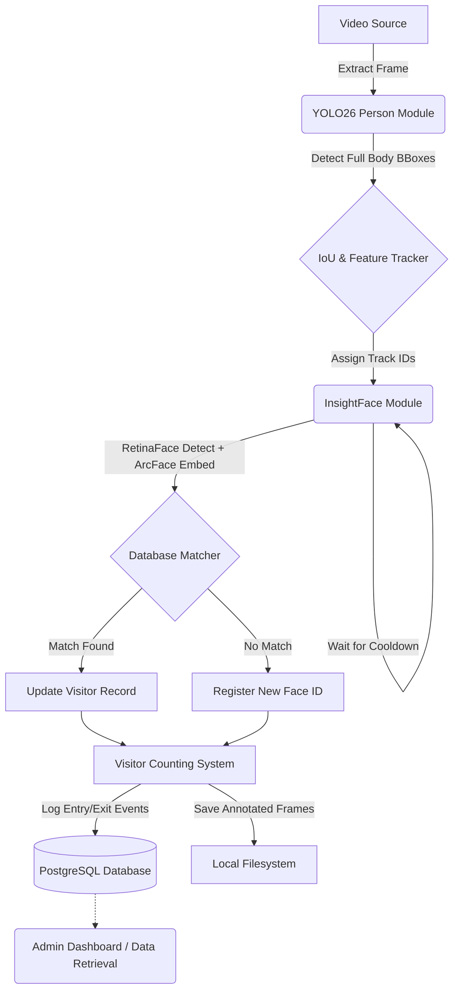

# Intelligent Face Tracker Architecture

This document covers the architectural flow of the system.

## System Pipeline Diagram

## Component Details

1. **Video Processor**
   - Handles RTSP streams and video files via OpenCV `VideoCapture`.
   - Uses configurable `process_every_n_frames` (Turbo Mode) and 30-FPS throttling mechanisms.
2. **Detection Layer**
   - Built on Ultralytics YOLO26 (`yolo26n.pt`).
   - Specifically targets the **person (body)** class instead of the face, guaranteeing stable tracking even when a subject turns around or is partially occluded.
3. **Tracking Layer**
   - Calculates Intersection over Union (IoU) matrices to associate historical tracks with current bounding boxes.
   - Designed to hold ghost-tracks (`max_age`) for up to 60 frames to survive occlusions.
4. **Recognition Layer**
   - Governed by an **Adaptive Cooldown** which tests close persons every 5 frames and distant persons every 40 frames, rescuing CPU loads.
   - Extracts bounding box crops and pushes them to InsightFace (RetinaFace + ArcFace) for 512-dimensional normalized embeddings.
   - Computes Cosine Similarity against the registry (threshold=0.38).
5. **Database Layer**
   - Exclusively handles high-throughput tracking interactions via `psycopg2` on PostgreSQL. Contains robust tracking for Entry/Exit counts and dwell times.
